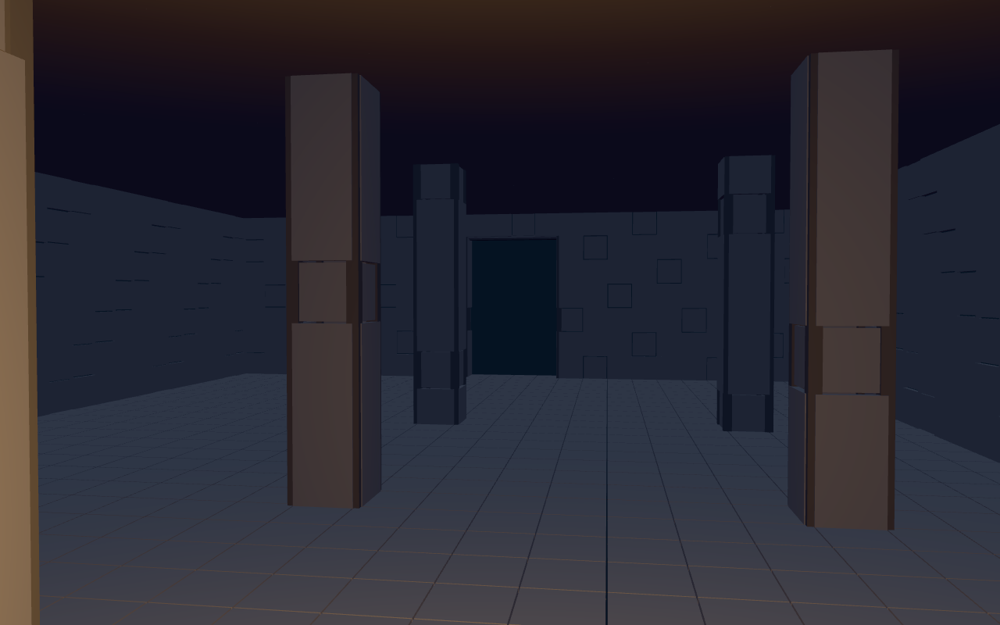
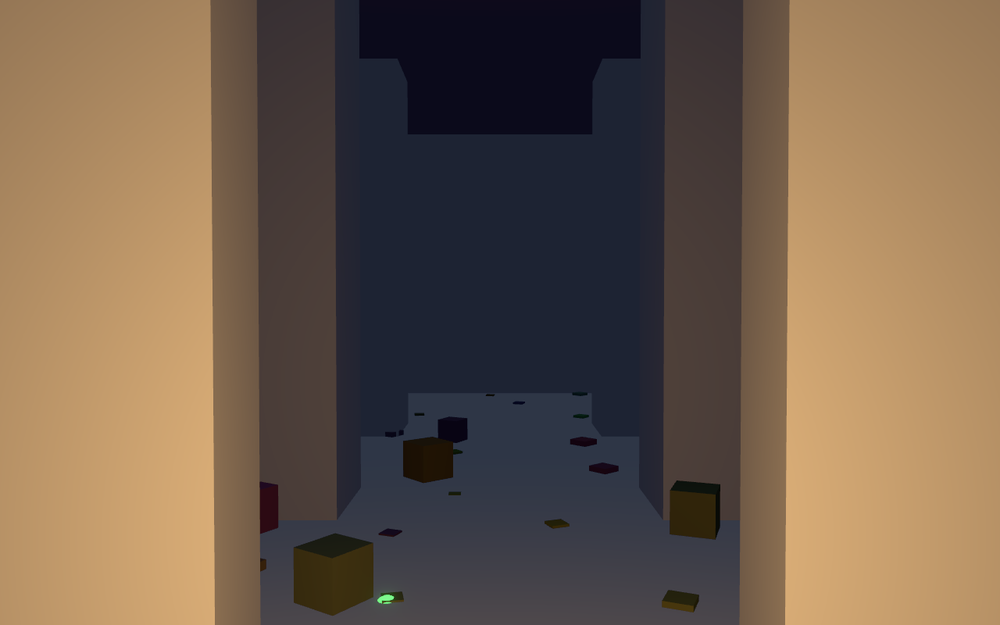
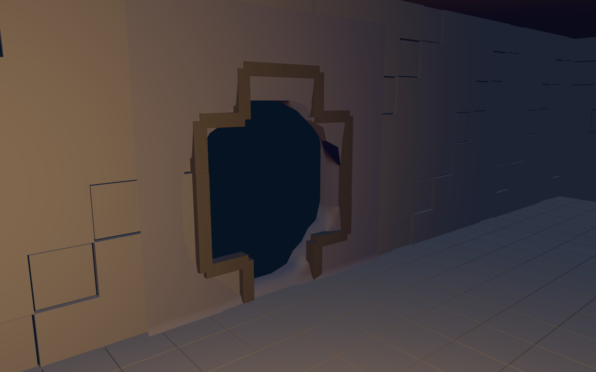
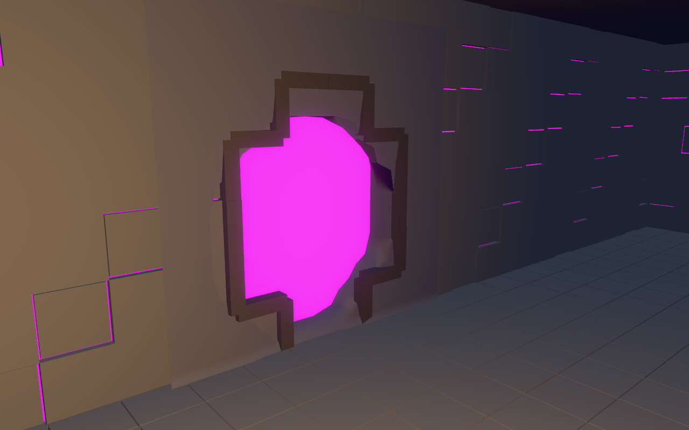

# Voxel-substrate spike — findings (2026-07-11)

Results of the S2 substrate spike + its seam-closure extension (branch
`spike-voxel-substrate`, throwaway code; 21 commits, all verdicts user-gated
2026-07-11). This doc is the durable record — the branch may be deleted at any
time. Companion pre-decision research:
`docs/research/2026-07-10-world-substrate-and-region-composition.md`. Full
execution trail (P0 tables, per-task deviations, all 22 screenshots): the
branch's `packages/dungeon/src/spike/NOTES.md`.

## What was probed

S2 = the two-resolution voxel substrate for built geometry: a **coarse 0.5 m
architecture grid** (cells = AIR/MASONRY) selects procedural kit pieces for
render; a **fine 0.25 m occupancy grid** (rasterized from coarse, 2× per axis)
owns carving and collision (the existing ghost-free voxels collider). Carved
breaches render as a local Surface-Nets patch of the same fine grid. One fixed
pillar-hall (interior 24×32×7 coarse cells) was stamped, skinned with ~7
procedural piece generators, walked with the real `CharacterMover`, carved, and
compared side-by-side with today's mesh `pillarHall` under identical lighting.

## Verdicts (all HOLD except the one tracked dependency)

| Premise | Verdict | Key evidence |
|---|---|---|
| P1 Grid fits kit + capsule | HOLDS | 0.5/0.25 exact; capsule 0.6 Ø clears the 2.0 m door with 1.0 m slack; walked |
| P2 Coarse stamp reads as the hall | HOLDS (gated) | plan/pillars/door legible in raw cell render |
| P3 Occupancy-driven kit skin quality | HOLDS (gated) | tiled floor + ashlar panels + framed door; richer surface than the mesh hall |
| P4 Collision agrees with render | HOLDS (probe-measured) | scripted walk: floor/walls/door/pillars clean, no ghost/wedge |
| P5-read Breach reads as damage | HOLDS (gated) | rough patch in crisp wall = the thesis image |
| P5-traversal Breach crossable | **WEDGES — tracked dependency** | rim-riding on the carved voxel rim; see below |
| E1 Per-face suppression exact | HOLDS | drops 16 pieces vs the old AABB's 48; no under/over-strip in unit tests |
| E2 Patch box backs every suppressed piece | HOLDS (gated) | property test over 3 spheres; 8-framing magenta void check: no void band |
| E3 2-piece rim collar reads intentional | HOLDS (gated) | collar frames the hole as a built edge; no iteration needed |

## Load-bearing mechanisms (what the real implementation reuses as design)

- **Two-resolution scheme.** Coarse grid is authoritative for BUILT structure;
  fine grid is derived by rasterization (2× per axis) plus carve edits, and is
  the single source for collision (`voxelsFromField`-style shell → voxels body)
  AND for carve-patch meshing. Precedent-consistent (SE2's unified grid); skinning
  a 0.25 m grid directly explodes instance counts — don't.
- **Skin = per-face kit pieces, no backing.** A wall panel is emitted for every
  masonry face adjacent to in-grid AIR (yaw from a 4-entry direction table),
  floor/ceiling tiles from vertical adjacency, corner posts at perpendicular
  exposed-face pairs, door frames from door metadata (never inferred from
  occupancy). Panels sit proud (0.06 m) of the collision plane — imperceptible
  (the safe direction). Consequence: a dropped panel is a window to void, which
  is why the seam mechanisms below exist. The "render backing masonry / flush
  panels / lean into mortar reveals" choice (option d) is an OPEN charter item.
- **Per-face suppression (E1).** A piece is dropped iff the SUB×SUB fine-cell
  *face layer* physically backing it was carved (whole-owner-cell conservative
  test for small pieces: posts, frames). Not AABB-based — an interior-only carve
  suppresses nothing.
- **Carve-derived patch box + shared source of truth (E2).** The patch box =
  AABB of the carved fine cells expanded by `SUB+1` fine cells (COARSE+FINE),
  which geometrically guarantees every per-face-suppressed piece is backed by
  patch facsimile. The function returns the box it meshed so the property test
  and the render consume ONE box — a too-small box cannot pass the test while
  showing void. Carve near corner/door pieces wants `SUB+2` (≈0.05 m slack
  measured at SUB+1 for those; untested — flat-wall breach emits none).
- **Single-carve consistency.** One `prepareBreach` computes {carved fine grid,
  carved set, patch, rim} and threads the SAME object to render suppression and
  collider build — render and collision cannot diverge.
- **Rim collar (E3).** Two yaw-only authored pieces (`rimPostV`, `rimEdgeH`,
  0.14 section, prouder than panels) emitted at every suppressed↔kept panel
  junction in (cell, face) space, from the suppressed side only (no dedup
  needed). Reads as a built edge around damage. A richer case set
  (corners/diagonals, opening-sized collars) is polish, not mechanism.
- **Determinism.** Skin and rim emission are pure functions of (grid, door,
  carve) — no rng, no time; byte-identical across runs. Substrate ops are
  integer; nothing consumed transcendentals (the Pr-2 JSC/V8 class is not in
  play).

## Standard drifts to decide at charter time

Grid quantization moved three standards (recorded, not silently absorbed):
door 1.6→**2.0** wide and 2.8→**3.0** tall (neither quantizes to 0.5); wall
0.4→**0.5**; pillar section 0.7 dropped (0.5/1.0 quantize). Decide: standards
move to grid-friendly values, or the grid accommodates (finer coarse cell).

## The one tracked dependency: carved-rim traversal

The `CharacterMover` rim-rides/wedges on carved voxel rims (y oscillates,
pins; two carve geometries, identical wedge; everything un-carved walks clean).
Known class: `docs/learnings/` 2.2.1 rim-riding + the Jolt proof
(`docs/learnings/jolt-mesh-collision-spike.md`,
`docs/backlog/engine-architecture/jolt-backend-swap.md`). Roadmapped fix =
field→mesh→collide-on-Jolt (`CharacterVirtual`), which ALSO unifies the
render/collision rim (in the spike you collide invisible voxel steps under a
smoothed patch). Honest gap: Jolt has been proven on cave trimeshes, NOT on a
carved-breach patch — cheap decisive check when triggered: rebuild the spike's
carved patch as a Jolt `MeshShape` and drive `CharacterVirtual` through the
hole. Alternatives if Jolt is deferred: rim collar as collision, or constrain
carves away from the walkable band.

## Carry-list for the charter (from the branch NOTES §Open questions)

1. Wall render model — proud panels w/ reveals vs backing vs flush (option d);
   also a better variant selector than the `%5` hash (faint banding).
2. Rim collar case set beyond 2 pieces; floor-rim path correct-by-construction
   but unexercised.
3. Per-region grids + world-scale memory layout (chunked, palette/RLE — see the
   companion research doc §6) + the streaming story.
4. Material/UV atlas strategy for kit + patch (spike used flat colors).
5. Door/wall standard drift (above).
6. Patch field is BINARY (±0.5) → smoothed-blocky carves; a signed-distance
   neighborhood field would give organic curvature (charter refinement).
